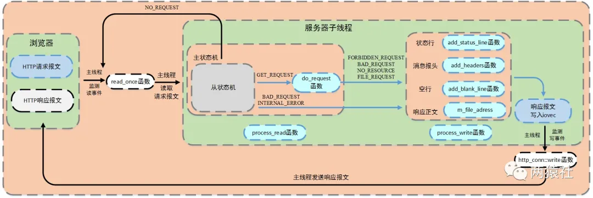
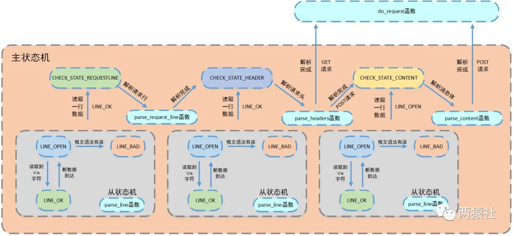

# 一、epoll
`关于epoll的详细说明请查阅《Linux高性能服务器编程》第9章 I/O复用`

下面介绍几个epoll的函数, 它们都需要包含头文件`<sys/epoll.h>`
```c
 int epoll_create(int size);

 int epoll_ctl(int epfd, int op, int fd, struct epoll_event *event);

 int epoll_wait(int epfd, struct epoll_event *events,int maxevents, int timeout);
```
## epoll_create函数
`int epoll_create(int size);`

#### 功能
用于创建 epoll 实例
```
epoll实例是什么？
    epoll 实例维护了一个事件表，用于存储已注册的文件描述符及其关联的事件信息；
    epoll 实例使用 struct epoll_event 结构体来表示每个文件描述符关联的事件信息。这个结构体包含了事件类型（如可读、可写、错误等），以及用户数据（可以是指针、文件描述符或无符号整数）
```
#### 参数
epoll_create 函数接受一个整数参数 size，用于指定 epoll 实例能够监听的文件描述符的数量上限。该参数在新版本的 Linux 内核中已被忽略，可以传递任意非负值。
#### 返回值
函数返回一个整数值表示 epoll 实例的文件描述符，该描述符将用作其他epoll系统调用的第一个参数；

如果返回值为 -1，则表示创建 epoll 实例失败，可以使用 errno 来获取错误码。

## epoll_ctl函数
`int epoll_ctl(int epfd, int op, int fd, struct epoll_event *event)`
#### 功能
用于操作内核事件表监控的文件描述符上的事件：注册、修改、删除，即向 epoll 实例中添加、修改或删除感兴趣的文件描述符及其关联的事件
#### 参数
* `epfd` 是 epoll 实例的文件描述符，通过 epoll_create 获得
* `op` 是操作类型，可以是以下三个值之一：
    * `EPOLL_CTL_ADD`：注册新的fd到epfd, 新的事件由 struct epoll_event 结构体指定
    * `EPOLL_CTL_MOD`：修改已经注册的fd的监听事件，新的事件由 struct epoll_event 结构体指定
    * `EPOLL_CTL_DEL`：从 epoll 实例中删除文件描述符 fd
* `fd` 是要操作的目标文件描述符

* `event` 用于指定要添加、修改或删除的事件。struct epoll_event 结构体定义如下：
```c
struct epoll_event {
    __uint32_t events;    // 事件类型
    epoll_data_t data;    // 用户数据
};

typedef union epoll_data {
    void *ptr;            // 指针类型的用户数据
    int fd;               // 文件描述符类型的用户数据
    __uint32_t u32;       // 32 位无符号整数类型的用户数据
    __uint64_t u64;       // 64 位无符号整数类型的用户数据
} epoll_data_t;
```
```
1. 结构体中的 events 指定事件类型，可以是以下几种事件的位掩码（使用 | 运算符组合多个事件）：

EPOLLIN：可读事件，表示文件描述符可读。
EPOLLOUT：可写事件，表示文件描述符可写。
EPOLLRDHUP：对端关闭连接或关闭写端。
EPOLLHUP：连接关闭或挂起事件。
EPOLLERR：错误事件。
EPOLLET：边缘触发模式（Edge Triggered mode）。
EPOLLONESHOT：一次性事件。添加事件后，只能触发一次，之后需要重新添加事件。

2. 结构体中的 data 字段用于存储用户数据，可以是指针类型、文件描述符类型或无符号整数类型。
```
#### 返回值
成功返回0，失败返回-1并且设置errno

## epoll_wait函数
`int epoll_wait(int epfd, struct epoll_event *events, int maxevents, int timeout)`

#### 功能
阻塞当前线程，直到有事件发生或超时
#### 参数
* `epfd` 是 epoll 实例的文件描述符
* `events` 用来存内核得到事件的集合
* `maxevents` 是 events 数组的大小，即最大可以接收的事件数量，不能大于创建epoll_create()时的size参数
* `timeout` 是等待的超时时间（以毫秒为单位），可以设置为以下几个值：
    * -1：永久阻塞，直到有事件发生。
    * 0：立即返回，不阻塞线程，用于非阻塞的轮询。
    * 大于 0：等待指定的毫秒数后超时返回。

epoll_wait 函数会将发生的事件信息填充到 events 数组中，并返回实际发生的事件数量，或者在出错或超时时返回特定的错误码
#### 返回值
成功时，返回就绪的文件描述符个数

失败时，返回-1并设置errno

***
***
<span style="color: yellow;font-size: 18px;">关于select/poll/epoll函数的对比，请[点击此处](./appendix/select_poll_epoll对比与触发模式.md)了解</span>
***
***

# 二、http报文格式
http报文分为
* 请求报文
* 响应报文

每种报文必须按照特有格式生成，才能被浏览器端识别，浏览器端向服务器发送的为请求报文，服务器处理后返回给浏览器端的为响应报文
## 请求报文
HTTP 请求报文是客户端向服务器发送的数据格式，用于请求特定资源或执行特定操作。它由`请求行`、`请求头部`、`空行`和`请求正文`组成。

请求分为两种，GET和POST，注意GET没有请求正文

`GET`：一种用于从服务器获取数据的请求方法

    1    GET /562f25980001b1b106000338.jpg HTTP/1.1
    2    Host:img.mukewang.com
    3    User-Agent:Mozilla/5.0 (Windows NT 10.0; WOW64)
    4    AppleWebKit/537.36 (KHTML, like Gecko) Chrome/51.0.2704.106 Safari/537.36
    5    Accept:image/webp,image/*,*/*;q=0.8
    6    Referer:http://www.imooc.com/
    7    Accept-Encoding:gzip, deflate, sdch
    8    Accept-Language:zh-CN,zh;q=0.8
    9    空行
    10   请求数据为空


`POST`：一种用于向服务器提交数据的请求方法

    1    POST / HTTP1.1
    2    Host:www.wrox.com
    3    User-Agent:Mozilla/4.0 (compatible; MSIE 6.0; Windows NT 5.1; SV1; .NET CLR 2.0.50727; .NET CLR 3.0.04506.648; .NET CLR 3.5.21022)
    4    Content-Type:application/x-www-form-urlencoded
    5    Content-Length:40
    6    Connection: Keep-Alive
    7    空行
    8    name=Professional%20Ajax&publisher=Wiley

### 请求行
* 格式：`<method> <URL> <HTTP version>`
* 用来说明请求类型,要访问的资源以及所使用的HTTP版本。
* 解释：在上面的GET请求报文的第一行为请求行，GET说明请求类型为GET，/562f25980001b1b106000338.jpg(URL)为要访问的资源，该行的最后一部分说明使用的是HTTP1.1版本。

### 请求头部
紧接着请求行（即第一行）之后的部分，用来说明服务器要使用的附加信息。下面的解释包含了GET和POST两种请求的请求头部

* HOST，给出请求资源所在服务器的域名。

* User-Agent，HTTP客户端程序的信息，该信息由你发出请求使用的浏览器来定义,并且在每个请求中自动发送等。

* Accept，说明用户代理可处理的媒体类型。

* Accept-Encoding，说明用户代理支持的内容编码。

* Accept-Language，说明用户代理能够处理的自然语言集。

* Content-Type，说明实现主体的媒体类型。

* Content-Length，说明实现主体的大小。

* Connection，连接管理，可以是Keep-Alive或close。

### 空行
请求头部后面的空行是必须的即使第四部分的请求数据为空，也必须有空行。

### 请求正文
* 请求正文是可选的，主要用于在某些请求方法（如 POST）中传递数据给服务器，GET中就没有请求正文。
* 请求正文可以包含表单数据、JSON 数据等。
```
请求报文中每一行的数据由 \r\n 作为结束字符，空行则是只有字符 \r\n 没有其它字符
```
## 响应报文
响应报文（Response Message）是在客户端向服务器发起请求后，服务器返回给客户端的数据结构，用于传递服务器对请求的处理结果
```
 1 HTTP/1.1 200 OK
 2 Date: Fri, 22 May 2009 06:07:21 GMT
 3 Content-Type: text/html; charset=UTF-8
 4 空行
 5 <html>
 6       <head></head>
 7       <body>
 8             <!--body goes here-->
 9       </body>
10 </html>
```
响应报文通常遵循HTTP（Hypertext Transfer Protocol）协议的规范，根据请求的类型和服务器的处理结果，包含以下重要的组成部分：
* `状态行（Status Line）`：由HTTP协议版本号， 状态码， 状态消息 三部分组成，HTTP有5种类型的状态码：

    * 1xx：指示信息--表示请求已接收，继续处理。
    * 2xx：成功--表示请求正常处理完毕。
        * 200 OK：客户端请求被正常处理。
        * 206 Partial content：客户端进行了范围请求。
    * 3xx：重定向--要完成请求必须进行更进一步的操作。
        * 301 Moved Permanently：永久重定向，该资源已被永久移动到新位置，将来任何对该资源的访问都要使用本响应返回的若干个URI之一。
        * 302 Found：临时重定向，请求的资源现在临时从不同的URI中获得。
    * 4xx：客户端错误--请求有语法错误，服务器无法处理请求。
        * 400 Bad Request：请求报文存在语法错误。
        * 403 Forbidden：请求被服务器拒绝。
        * 404 Not Found：请求不存在，服务器上找不到请求的资源。
    * 5xx：服务器端错误--服务器处理请求出错。
        * 500 Internal Server Error：服务器在执行请求时出现错误。
* `响应头部（Response Headers）`：用来说明客户端要使用的一些附加信息。第二行和第三行为响应头部，包含了与响应相关的元信息，如日期、内容类型、缓存控制等。常见的响应头部字段包括：
Date:生成响应的日期和时间；
Content-Type：指定响应体的数据类型，如 text/html、application/json 等。
Content-Length：指定响应体的长度。
Cache-Control：指定响应的缓存策略。
* `空行`：空行用于分隔响应头部和响应正文。
* `响应正文（Response Body）`：响应正文包含了服务器返回给客户端的实际数据，可以是文本、HTML、JSON、图片等。响应体的格式和内容取决于服务器的处理逻辑和请求的要求。上面的例子中空行后面的html部分为响应正文。

# 三、http处理流程
1. `浏览器端`----http连接请求---->`服务器端`
2. 服务器端对连接请求进行处理
* 主线程
    * 创建http对象接收连接请求并将所有数据读入对应buffer
    * 将该http对象插入任务队列
* 工作线程（子线程）
    * 从任务队列中取出一个任务通过process函数进行处理
    * `报文解析`：process函数中会调用process_read函数，通过主、从状态机对请求报文进行解析，process_read函数中会调用do_request函数生成响应报文。
    * `报文响应`：process函数中会调用process_write将响应报文返回给浏览器端
<p align="center">

</p>
***
***
<span style="color: yellow;font-size: 18px;">http类的实现见[此处](../Code/http/http_conn.h)，使用http类接受http请求的代码见main.c</span>
*** 
***

## 用状态机模型进行http报文解析
从状态机负责读取报文的一行，主状态机负责对该行数据进行解析，主状态机内部调用从状态机，从状态机驱动主状态机。

主从状态机在http_conn.h中的定义如下所示
```c
//主状态机，表示解析位置
enum CHECK_STATE{ 
        CHECK_STATE_REQUESTLINE=0, //解析请求行
        CHECK_STATE_HEADER, //解析请求头
        CHECK_STATE_CONTENT //解析消息体，仅用于解析POST请求
        };
//从状态机，表示解析一行的读取状态
enum LINE_STATUS 
    {
        LINE_OK = 0, //完整读取一行
        LINE_BAD, //报文语法有误
        LINE_OPEN //读取的行不完整
    };
```
主从状态机的工作流程如图所示
<p align="center">

</p>
可以看到，最大的矩形框代表主状态机，三个小一些的矩形框代表从状态机；

主状态机有三种状态，表示读入了请求报文的对应行
* CHECK_STATE_REQUESTLINE
* CHECK_STATE_HEADER
* CHECK_STATE_CONTENT

从状态机也有三种状态，表示读这行的读取状态
* LINE_OK，完整地读取了一行（以换行符标志）
* LINE_BAD，读到的报文语法有错，读取失败
* LINE_OPEN，读取的行不完整，说明读到了最后一行（最后一行没有\r\n）

从请求报文的第一行开始，从状态机读取请求报文的第一行，如果读取成功达到LINE_OK状态主状态机才会达到CHECK_STATE_REQUESTLINE状态，然后调用parse_request_line函数解析请求行，然后对于从状态机成功读取的每一行如果返回LINE_OK状态都说明读入了请求报文的请求头部，只有返回LINE_OPEN状态才说明读到了请求报文的请求内容，读取并解析成功后跳转do_request函数生成响应报文。

## 响应报文生成
### url介绍
url即浏览器网址栏中的字符，可以将其抽象成ip:port/xxx，xxx通过html文件的action属性进行设置。

在http类中m_url表示请求报文中解析出的请求资源，也就是url中的/xxx，本项目中解析后的m_url设置了8种情况。
```
/

GET请求，跳转到judge.html，即欢迎访问页面

/0

POST请求，跳转到register.html，即注册页面

/1

POST请求，跳转到log.html，即登录页面

/2CGISQL.cgi

POST请求，进行登录校验

验证成功跳转到welcome.html，即资源请求成功页面

验证失败跳转到logError.html，即登录失败页面

/3CGISQL.cgi

POST请求，进行注册校验

注册成功跳转到log.html，即登录页面

注册失败跳转到registerError.html，即注册失败页面

/5

POST请求，跳转到picture.html，即图片请求页面

/6

POST请求，跳转到video.html，即视频请求页面

/7

POST请求，跳转到fans.html，即关注页面
```
### do_request函数
