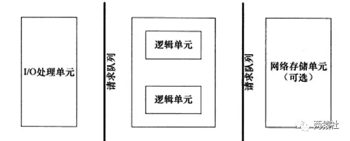

# 什么是Web Server
* 定义：Web Server是一个B/S架构中的服务器程序，B是Browser即浏览器，S是Server即服务器。
* 主要功能：通过“HTTP写”与浏览器进行通信，来接收、存储、处理来自浏览器的HTTP请求，然后对其请求做出HTTP响应（发送响应报文（文件、网页等）或者是一个Error信息）

* 浏览器和服务器的连接过程：
1. 浏览器输入域名或者IP地址:端口号，如果输入的是域名，浏览器会将其解析成IP地址
2. 根据IP地址:端口号通过TCP三次握手建立与目标服务器的连接，
3. 然后HTTP协议生成针对该服务器的HTTP请求报文，该请求包括请求方法（例如GET、POST）、请求头（包含一些元数据）、请求体（对于POST请求）以及请求的URL等
4. 服务器处理请求：Web服务器接收到浏览器发送的HTTP请求后，会根据请求的内容进行处理。这可能包括读取请求的URL、解析请求参数、处理业务逻辑等。
5. 服务器响应：服务器根据请求的处理结果生成一个HTTP响应，并将其发送回浏览器。响应包括状态码、响应头（包含元数据）以及响应体（包含实际的响应数据）

# 如何实现高并发的WebServer

* 多路IO复用
* 连接过程：Web服务器通过某个端口利用socket监听来自用户的请求，用户则尝试connect()这个web server的端口，监听到的这些连接会排队被accept()
* 并发：由于用户连接是随机到达的事件，每当监听socket(listenfd)监听到新的客户连接并放入监听队列，我们都需要告诉web server有连接来了并accept这个连接，然后分配一个用户单元来处理这个用户请求，处理用户请求的同时也要继续监听其它客户的请求并分配另一逻辑单元来处理其它的用户请求
* epoll:服务器通过epoll这种I/O复用技术来实现对监听socket(listenfd)和连接socket(clientfd)的同时监听，epoll本身是阻塞的，当有多个文件描述符同时就绪时，如果不采取额外措施程序就只能按顺序处理其中就绪的每一个文件描述符
* 线程池：为了提高效率，利用线程池来实现并发（多线程并发），给每个就绪的文件描述符分配一个线程（前面提到的逻辑单元）来处理

# 项目框架

* I/O多路复用模块 —— epoll
* HTTP对象
* 阻塞队列
* 定时器模块 —— 通过定时器来清除不活跃的连接减少高并发场景下不必要的系统资源的占用 
* 日志模块 —— 记录服务器日常运行情况
* 线程池模块 —— 主线程负责连接的建立和断开，同时将读写和逻辑处理任务加入线程池里的任务队列，由线程池里的线程负责完成相应操作实现任务的并行处理
* 缓冲区模块 —— 用于临时存储和处理请求和响应数据

对于服务器端，主要由`I/O单元`，`逻辑单元`和`网络存储单元`组成，其中每个单元之间通过请求队列进行通信，从而协同完成任务。
* I/O单元： 处理客户端连接，读写网络数据的线程
* 逻辑单元： 处理业务逻辑的线程
* 网络存储单元： 网络存储单元指本地数据库和文件等

[-->下一篇](./服务器事件类别与处理模式.md)