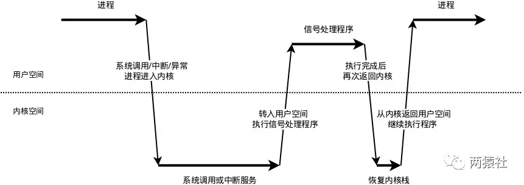

# 在本项目中的作用
定期检测`非活跃`连接，关闭文件描述符，释放连接资源
```
非活跃：是指客户端（这里是浏览器）与服务器端建立连接后，长时间不交换数据，一直占用服务器端的文件描述符，导致连接资源的浪费
```
# 在本项目中的用法
## 1 概述
* `定时事件`为定期检测非活跃连接
* 服务器主循环为每一个连接创建一个`定时器`，并对每个连接进行定时。
* 另外，利用升序时间链表作为`定时器容器`将所有定时器串联起来，若主循环接收到定时通知，则在链表中依次执行定时任务。
```
定时事件：是指固定一段时间之后触发某段代码，由该段代码处理一个事件，如从内核事件表删除事件，并关闭文件描述符，释放连接资源

定时器:是指利用结构体或其他形式，将多种定时事件进行封装起来。具体的，这里只涉及一种定时事件，即定期检测非活跃连接，这里将该定时事件与连接资源封装为一个结构体定时器。

定时器容器:是指使用某种容器类数据结构，将上述多个定时器组合起来，便于对定时事件统一管理。
```
## 2 SIGALRM信号

本项目中使用的是`SIGALRM`信号，具体的做法是
* 利用alarm函数周期性地触发SIGALRM信号
* 信号处理函数利用管道通知主循环
* 主循环接收到该信号后对升序链表上所有定时器进行处理
* 若该段时间内没有交换数据，则将该连接关闭，释放所占用的资源
```
Linux下提供了三种定时的方法:

* socket选项SO_RECVTIMEO和SO_SNDTIMEO

* SIGALRM信号

* I/O复用系统调用的超时参数
```
可以看出，定时器处理非活跃连接模块主要分为两部分
1. `定时方法与信号通知流程`
2. `定时器及其容器设计与定时任务的处理`

## 3 定时方法与信号通知流程
### 3.1 定时方法参考[>>信号API<<](./appendix/信号API.md)

### 3.2 信号通知流程
1. 创建管道，其中管道写端写入信号值，管道读端通过I/O复用系统监测读事件

2. 设置信号处理函数SIGALRM（时间到了触发）和SIGTERM（kill会触发，Ctrl+C）

    * 通过struct sigaction结构体和sigaction函数注册信号捕捉函数

    * 在结构体的handler参数设置信号处理函数，具体的，从管道写端写入信号的名字

3. 利用I/O复用系统监听管道读端文件描述符的可读事件

4. 信息值传递给主循环，主循环再根据接收到的信号值执行目标信号对应的逻辑代码

Linux下的信号采用的异步处理机制，信号处理函数和当前进程是两条不同的执行路线。
```
具体的，当进程收到信号时，操作系统会中断进程当前的正常流程，转而进入信号处理函数执行操作，完成后再返回中断的地方继续执行。
```
* `注意事项`：为避免信号竞态现象发生，信号处理期间系统不会再次触发它。所以，为确保该信号不被屏蔽太久，信号处理函数需要尽快执行完毕。

* `可能出现的问题`：一般的信号处理函数需要处理该信号对应的逻辑，当该逻辑比较复杂时，信号处理函数执行时间过长，会导致信号屏蔽太久。

* `解决方案`：信号处理函数仅仅发送信号通知程序主循环，将信号对应的处理逻辑放在程序主循环中，由主循环执行信号对应的逻辑代码。
#### 3.2.1 统一事件源
统一事件源，是指将信号事件与其他事件一样被处理。
```
具体的，信号处理函数使用管道将信号传递给主循环，信号处理函数往管道的写端写入信号值，主循环则从管道的读端读出信号值。
```
使用`I/O复用系统调用`来监听管道读端的可读事件，这样信号事件与其他文件描述符都可以通过epoll来监测，从而实现统一处理。

#### 3.2.2 信号处理机制
每个进程之中，都存着一个表，里面存着每种信号所代表的含义，内核通过设置表项中每一个位来标识对应的信号类型。
<p align="center">

</p>

* 信号的接收

接收信号的任务是由内核代理的，当内核接收到信号后，会将其放到对应进程的信号队列中，同时向进程发送一个中断，使其陷入内核态。注意，此时信号还只是在队列中，对进程来说暂时是不知道有信号到来的。

* 信号的检测, 进程陷入内核态后，有两种场景会对信号进行检测：
    
    * 进程从内核态返回到用户态前进行信号检测

    * 进程在内核态中，从睡眠状态被唤醒的时候进行信号检测

当发现有新信号时，便会进入下一步，信号的处理。

* 信号的处理

    * ( 内核 )信号处理函数是运行在用户态的，调用处理函数前，内核会将当前内核栈的内容备份拷贝到用户栈上，并且修改指令寄存器（eip）将其指向信号处理函数。

    * ( 用户 )接下来进程返回到用户态中，执行相应的信号处理函数。

    * ( 内核 )信号处理函数执行完成后，还需要返回内核态，检查是否还有其它信号未处理。

    * ( 用户 )如果所有信号都处理完成，就会将内核栈恢复（从用户栈的备份拷贝回来），同时恢复指令寄存器（eip）将其指向中断前的运行位置，最后回到用户态继续执行进程。

至此，一个完整的信号处理流程便结束了，如果同时有多个信号到达，上面的处理流程会在第2步和第3步骤间重复进行。

## 4 定时器及其容器设计与定时任务的处理
这里重申一下部分概念：`定时事件`、`定时器`、`定时器容器`
```
定时事件：是指固定一段时间之后触发某段代码，由该段代码处理一个事件，如从内核事件表删除事件，并关闭文件描述符，释放连接资源

定时器:是指利用结构体或其他形式，将多种定时事件进行封装起来。具体的，这里只涉及一种定时事件，即定期检测非活跃连接，这里将该定时事件与连接资源封装为一个结构体定时器。

定时器容器:是指使用某种容器类数据结构，将上述多个定时器组合起来，便于对定时事件统一管理。
```
相应的，`定时器设计`、`定时器容器设计`、`定时任务处理函数`指的是
```
定时器设计：将连接资源和定时事件等封装起来，具体包括连接资源、超时时间和回调函数，这里的回调函数指向定时事件。

定时器容器设计：将多个定时器串联组织起来统一处理，具体包括升序链表设计。

定时任务处理函数：该函数封装在容器类中，具体的，函数遍历升序链表容器，根据超时时间，处理对应的定时器。
```
### 4.1 定时器设计
项目中将`连接资源`、`定时事件`和`超时时间`封装为定时器类，具体的，

* `连接资源`：客户端套接字地址、文件描述符和定时器

* `定时事件`：回调函数，将其封装起来由用户自定义，这里的回调函数是删除非活动socket上的注册事件，并关闭

* `定时器超时时间` = 浏览器和服务器连接时刻 + 固定时间(TIMESLOT)，可以看出，定时器使用绝对时间作为超时值，这里alarm设置为5秒，连接超时为15秒。
### 4.2 定时器容器设计
项目中的定时器容器为带头尾结点的升序双向链表，为每个来自浏览器的客户连接创建一个定时器，将其添加到链表中，并按照超时时间升序排列。

执行定时任务时，将到期的定时器从链表中删除。

从实现上看，主要涉及双向链表的`插入`和`删除`操作，其中添加定时器的时间复杂度是O(n),删除定时器的时间复杂度是O(1)。

升序双向链表主要逻辑涉及以下步骤：
* 创建头尾节点，其中头尾节点没有意义，仅仅统一方便调整
* 调用add_timer函数，将目标定时器添加到链表中，添加时按照升序添加
    * 若当前链表中只有头尾节点，直接插入
    * 否则，将定时器按升序插入
* 调用adjust_timer函数，当定时任务发生变化,调整对应定时器在链表中的位置
    * 客户端在设定时间内有数据收发,则当前时刻对该定时器重新设定时间，这里只是往后延长超时时间
    * 被调整的目标定时器在尾部，或定时器新的超时值仍然小于下一个定时器的超时，不用调整
    * 否则先将定时器从链表取出，重新插入链表
* del_timer函数将超时的定时器从链表中删除
    * 常规双向链表删除结点

### 4.3 定时任务处理函数
SIGALRM信号每次被触发，主循环中就调用一次定时任务处理函数，来处理链表容器中到期的定时器
定时任务处理函数的逻辑如下：
* 遍历定时器升序链表容器，从头结点开始依次处理每个定时器，直到遇到尚未到期的定时器
* 若当前时间小于定时器超时时间，跳出循环，即未找到到期的定时器
* 若当前时间大于定时器超时时间，即找到了到期的定时器，执行回调函数，然后将它从链表中删除，然后继续遍历
### 4.4 定时器的使用
* 服务器首先创建定时器容器链表
* 然后用统一事件源将异常事件，读写事件和信号事件统一处理，根据不同事件的对应逻辑使用定时器。
    * 浏览器与服务器连接时，创建该连接对应的定时器，并将该定时器添加到链表上
    * 处理异常事件时，执行定时事件，服务器关闭连接，从链表上移除对应定时器
    * 处理定时信号时，将定时标志设置为true
    * 处理读事件时，若某连接上发生读事件，将对应定时器向后移动，否则，执行定时事件
    * 处理写事件时，若服务器通过某连接给浏览器发送数据，将对应定时器向后移动，否则，执行定时事件

下面的代码在main.c中
```c
//定时处理任务，重新定时以不断触发SIGALRM信号
void timer_handler()
{
    timer_lst.tick();//先处理定时器容器中的超时任务
    alarm(TIMESLOT);//alarm 用于设置定时，在TIMESLOT秒后发送 SIGALRM 信号给当前进程
}

//创建定时器容器链表
static sort_timer_lst timer_lst;

//创建连接资源数组，连接资源包括客户端套接字地址、套接字文件描述符和定时器指针
client_data *users_timer = new client_data[MAX_FD];

//超时默认为False
bool timeout = false;

//隔TIMESLOT秒后触发一次SIGALRM信号
alarm(TIMESLOT);

while (!stop_server)
{
    int number = epoll_wait(epollfd, events, MAX_EVENT_NUMBER, -1);
    if (number < 0 && errno != EINTR)
    {
        break;
    }

    for (int i = 0; i < number; i++)//--------------轮询文件描述符
    {
        int sockfd = events[i].data.fd;

        //处理新到的客户连接
        if (sockfd == listenfd)
        {
            //初始化客户端连接地址
            struct sockaddr_in client_address;
            socklen_t client_addrlength = sizeof(client_address);

            //该连接分配的文件描述符
            int connfd = accept(listenfd, (struct sockaddr *)&client_address, &client_addrlength);

            //初始化该连接对应的连接资源
            users_timer[connfd].address = client_address;
            users_timer[connfd].sockfd = connfd;

            //创建定时器临时变量
            util_timer *timer = new util_timer;
            //设置定时器对应的连接资源
            timer->user_data = &users_timer[connfd];
            //设置回调函数
            timer->cb_func = cb_func;

            time_t cur = time(NULL);
            //设置绝对超时时间
            timer->expire = cur + 3 * TIMESLOT;
            //创建该连接对应的定时器，初始化为前述临时变量
            users_timer[connfd].timer = timer;
            //将该定时器添加到链表中
            timer_lst.add_timer(timer);
        }
        //处理异常事件
        else if (events[i].events & (EPOLLRDHUP | EPOLLHUP | EPOLLERR))
        {
            //服务器端关闭连接，移除对应的定时器
            cb_func(&users_timer[sockfd]);

            util_timer *timer = users_timer[sockfd].timer;
            if (timer)
            {
                timer_lst.del_timer(timer);
            }
        }

        //处理定时器信号
        else if ((sockfd == pipefd[0]) && (events[i].events & EPOLLIN))
        {
            //接收到SIGALRM信号，timeout设置为True
        }

        //处理客户连接上接收到的数据
        else if (events[i].events & EPOLLIN)
        {
            //创建定时器临时变量，将该连接对应的定时器取出来
            util_timer *timer = users_timer[sockfd].timer;
            if (users[sockfd].read_once())
            {
                //若监测到读事件，将该事件放入请求队列
                pool->append(users + sockfd);

                //若有数据传输，则将定时器往后延迟3个单位
                //对其在链表上的位置进行调整
                if (timer)
                {
                    time_t cur = time(NULL);
                    timer->expire = cur + 3 * TIMESLOT;
                    timer_lst.adjust_timer(timer);
                }
            }
            else
            {
                //服务器端关闭连接，移除对应的定时器
                cb_func(&users_timer[sockfd]);
                if (timer)
                {
                    timer_lst.del_timer(timer);
                }
            }
        }
        else if (events[i].events & EPOLLOUT)
        {
            util_timer *timer = users_timer[sockfd].timer;
            if (users[sockfd].write())
            {
                //若有数据传输，则将定时器往后延迟3个单位
                //并对新的定时器在链表上的位置进行调整
                if (timer)
                {
                    time_t cur = time(NULL);
                    timer->expire = cur + 3 * TIMESLOT;
                    timer_lst.adjust_timer(timer);
                }
            }
            else
            {
                //服务器端关闭连接，移除对应的定时器
                cb_func(&users_timer[sockfd]);
                if (timer)
                {
                    timer_lst.del_timer(timer);
                }
            }
        }
    }
    //处理定时器为非必须事件，收到信号并不是立即处理，需要等待读写事件完成后再进行处理。
    if (timeout)
    {
        timer_handler();
        timeout = false;
    }
}
```
[>>下一篇](./日志.md)